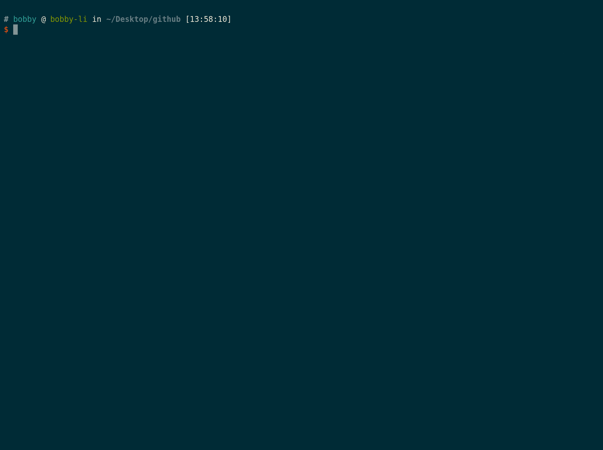

# 🐸 @omni-door/cli

https://www.omnidoor.org

The CLI Tool for set up standard frontend project.

[](https://www.npmjs.com/package/@omni-door/cli)
[](https://badge.fury.io/js/%40omni-door%2Fcli)
[](http://nodejs.org/download/)
[](https://travis-ci.com/omni-door/cli)
[](https://codecov.io/gh/omni-door/cli)
[](http://commitizen.github.io/cz-cli/)
[](https://packagephobia.now.sh/result?p=%40omni-door%2Fcli)
[](https://github.com/omni-door/cli/blob/master/LICENSE)





English | [简体中文](./docs/README.zh-CN.md)

[<omni.config.js> DETAILS](./docs/OMNI.md)

[CHANGELOG](./docs/CHANGELOG.md)

## install
The latest LTS version of Node.js is recommended, or at least ensure node >= 10.13.0

Several options to get up and running:

* Clone the repo: `git@github.com:omni-door/cli.git`

* Install with [npm](https://www.npmjs.com/package/@omni-door/cli): `npm install @omni-door/cli -g`

* Install with [Yarn](https://yarnpkg.com/en/package/@omni-door/cli): `yarn global add @omni-door/cli`

* Initial project with [npx](https://www.npmjs.com/package/@omni-door/cli): `npx @omni-door/cli init`

## omni --help
```shell
  Usage: index [command] [options]

  Options:

    -v, --version   output the version number
    -h, --help      output usage information

  Commands:

    init [options] [strategy]  initialize your project, [strategy] could be stable(default) or latest
    dev [options]              omni dev [-p <port>] [-H <host>] [-P <path>]
    start [options]            omni start [-p <port>] [-H <host>] [-P <path>]
    new [options] [name]       omni new [name] [-f | -c] [-P <path>]
    build [options]            build your project according to the [omni.config.js]'s build field
    release [options]          publish your project according to the [omni.config.js]'s release field

```

## omni init

### Initial your project by answer several questions
```shell
omni init
```

### Initial your project with lastest denpendencies
```shell
omni init lastest
```

### Initial your project without install dependencies
```shell
omni init -n
```

### Initial your project according to some template
```shell
omni init -t [projectName]
```
or
```shell
omni init --react_entire [projectName]
```

### options
```shell
Usage: omni init [strategy] [options]

initialize your project, [strategy] could be stable(default) or latest

Arguments:

  strategy                 stable or latest

Options:
  -rb, --react_basic [name]       create a basic React SPA project
  -rs, --react_standard [name]    create a standard React SPA project
  -re, --react_entire [name]        create a most versatile React SPA project
  -rp, --react_pc [name]          create a React SPA project based on Antd
  -vb, --vue_basic [name]         create a basic Vue SPA project
  -vs, --vue_standard [name]      create a standard Vue SPA project
  -ve, --vue_entire [name]        create a most versatile Vue SPA project
  -rS, --react_ssr [name]         create a React component library
  -rc, --react_components [name]  create a React component library
  -vc, --vue_components [name]    create a Vue component library
  -t, --toolkit [name]            create a toolkit project
  -n, --no-install                init project without install dependencies
  -P, --path <path>               the workpath for init the project
  -h, --help                      output usage information
```

---

## omni dev

### options
```shell
Usage: omni dev [options]

omni dev [-p <port>] [-H <host>] [-P <path>]

Options:
  -p, --port <port>      start the dev-server according to the specified port
  -H, --hostname <host>  start the dev-server according to the specified hostname
  -P, --path <path>      the workpath for start the dev-server
  -h, --help             output usage information
```

---

## omni start

### options
```shell
Usage: omni start [options]

omni start [-p <port>] [-H <host>] [-P <path>]

Options:
  -p, --port <port>      start the prod-server according to the specified port
  -H, --hostname <host>  start the prod-server according to the specified hostname
  -P, --path <path>      the workpath for start the prod-server
  -h, --help             output usage information
```

---

## omni new

### options
```shell
Usage: omni new [name] [options]

omni new [name] [-f | -c] [-P <path>]

Arguments:

  name              optional! The name of component.

Options:
  -f, --function     create a React-Function-Component
  -c, --class        create a React-Class-Component
  -r, --render       create a Vue-Render-Function
  -s, --single       create a Vue-Single-File-Component
  -P, --path <path>  the workpath for create component
  -h, --help         display help for command
```

---

## omni build

### options
```shell
Usage: omni build [options]

build your project according to the [omni.config.js]'s build field

Options:
  -c, --config <path>  specify the path of config file
  -n, --no-verify      bypass all pre-check before building
  -P, --path <path>    the workpath for build project
  -h, --help           output usage information
```

---

## omni release

### options
```shell
Usage: omni release [options]

publish your project according to the [omni.config.js]'s release field

Options:
  -a, --automatic         automatic iteration version
  -i, --ignore            ignore automatic iteration version
  -m, --manual <version>  manual iteration version
  -t, --tag <tag>         the tag will add to npm-package
  -n, --no-verify         bypass unit-test eslint and stylelint check
  -P, --path <path>       the workpath for release project
  -h, --help              output usage information
```

---

## API Docs
click [here](./docs/DEV.md)

## License

Copyright (c) 2019 [Bobby.li](https://github.com/BobbyLH)

Released under the MIT License