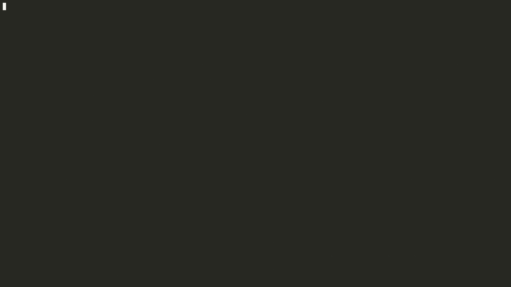

# 🐸 @omni-door/cli

https://www.omnidoor.org

A CLI for scaffolding standard frontend projects and running common dev/build/release tasks.

[](https://www.npmjs.com/package/@omni-door/cli)
[](https://badge.fury.io/js/%40omni-door%2Fcli)
[](http://nodejs.org/download/)
[](https://travis-ci.com/omni-door/cli)
[](https://codecov.io/gh/omni-door/cli)
[](http://commitizen.github.io/cz-cli/)
[](https://packagephobia.now.sh/result?p=%40omni-door%2Fcli)
[](https://github.com/omni-door/cli/blob/master/LICENSE)
[](https://github.com/omni-door/cli)
[](https://www.typescriptlang.org/)
[](https://github.com/omni-door/cli/pulls)



English | [简体中文](./docs/README.zh-CN.md)

## Why omni-door?

**omni-door** is a comprehensive CLI tool that helps you:

- **One Command Setup** - Initialize production-ready projects with a single command
- **Multi-Framework Support** - Create React/Vue SPAs, SSR apps, component libraries, and toolkits
- **Unified Workflow** - Consistent dev/build/release experience across all project types
- **Plugin System** - Extend functionality with custom plugins for build and release stages
- **TypeScript First** - Full TypeScript support out of the box
- **Best Practices** - Pre-configured with ESLint, Prettier, Commitlint, and testing frameworks

## Features

| Feature | Description |
|---------|-------------|
| 🚀 **Quick Start** | Initialize a complete project in minutes |
| ⚛️ **React Support** | SPA, SSR (Next.js), and component libraries |
| 💚 **Vue Support** | SPA and component libraries |
| 📦 **Toolkit** | Create SDK/utility libraries with ease |
| 🔧 **Dev Server** | Built-in Express server with HMR and proxy support |
| 🏗️ **Build Tools** | Webpack, Rollup, Gulp, and TSC integration |
| 📤 **Release** | Automated versioning, git tagging, and npm publishing |
| 🔌 **Plugins** | Extensible architecture for custom workflows |

## Comparison with Other Tools

| Feature | omni-door | create-react-app | vue-cli | vite |
|---------|:---------:|:----------------:|:-------:|:----:|
| React SPA | ✅ | ✅ | ❌ | ✅ |
| Vue SPA | ✅ | ❌ | ✅ | ✅ |
| React SSR | ✅ | ❌ | ❌ | Plugin |
| Component Library | ✅ | ❌ | ❌ | ❌ |
| Toolkit/SDK | ✅ | ❌ | ❌ | ❌ |
| Plugin System | ✅ | ❌ | ✅ | ✅ |
| Unified Release | ✅ | ❌ | ❌ | ❌ |
| Multi-build Tools | ✅ | ❌ | ❌ | ❌ |

## Requirements
- Node.js >= 10.13.0 (latest LTS recommended)

## Installation
- Clone: `git@github.com:omni-door/cli.git`
- npm: `npm install @omni-door/cli -g`
- Yarn: `yarn global add @omni-door/cli`
- npx (no install): `npx @omni-door/cli init`

## Quick Start
```shell
omni init
```

## Commands
Run `omni --help` for the full option list.

- `omni init [strategy]` scaffold a project (stable or latest)
- `omni dev` start the development server
- `omni start` start the production server
- `omni new [name]` create a component/template
- `omni build` build the project based on `omni.config.js`
- `omni release` publish the project based on `omni.config.js`

Pass-through args are supported for `dev`, `start`, and `build`:
```shell
omni dev -- --webpack
omni start -- --hostname 0.0.0.0
omni build -- --webpack
```

## Supported Project Types

| Type | Description | Command |
|------|-------------|---------|
| `spa-react` | React Single Page Application | `omni init -rb` |
| `spa-react-pc` | React Admin App (Antd-based) | `omni init -rp` |
| `spa-vue` | Vue Single Page Application | `omni init -vb` |
| `ssr-react` | React Server-Side Rendering | `omni init -rS` |
| `component-react` | React Component Library | `omni init -rc` |
| `component-vue` | Vue Component Library | `omni init -vc` |
| `toolkit` | SDK/Utility Library | `omni init -t` |

## Configuration
See the `omni.config.js` reference: [docs/OMNI.md](./docs/OMNI.md)

## Docs
- API/Plugin docs: [docs/DEV.md](./docs/DEV.md)
- Changelog: [docs/CHANGELOG.md](./docs/CHANGELOG.md)

## Contributing

We welcome contributions! Please see our contributing guidelines for details.

## License

Copyright (c) 2019 [Bobby.li](https://github.com/BobbyLH)

Released under the MIT License
